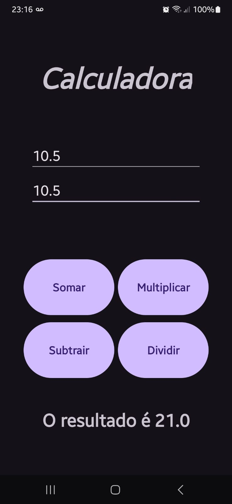
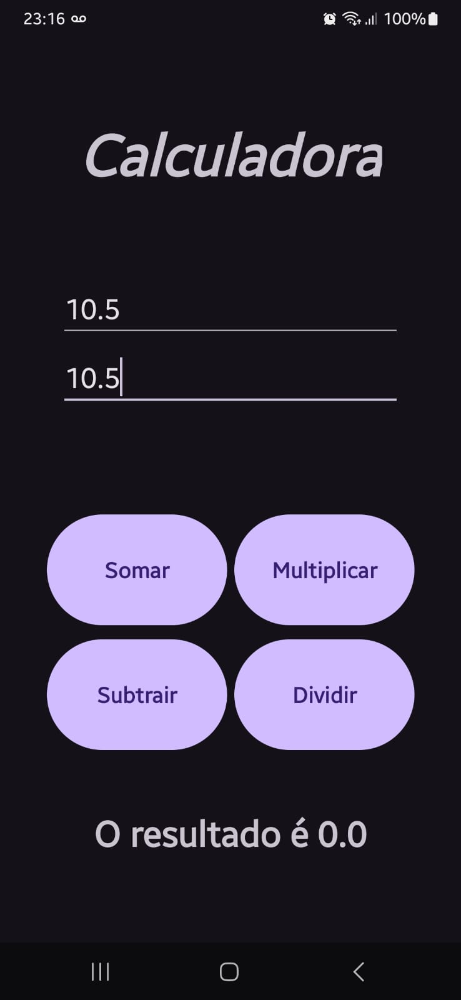
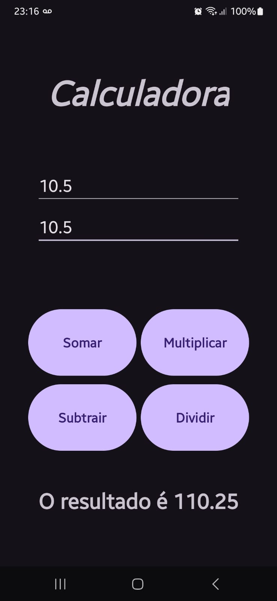
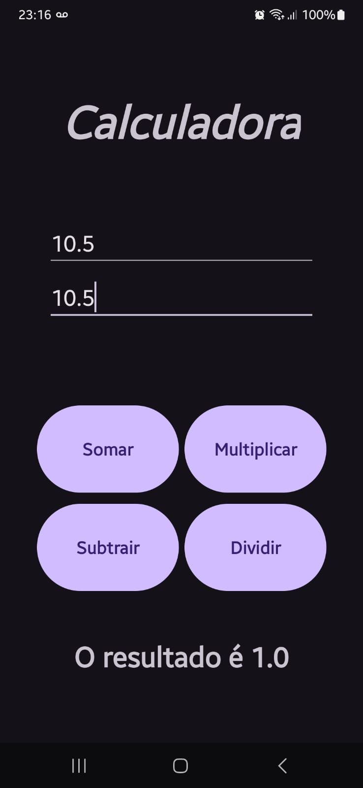

# Calculadora

 - Desenvolva um app chamado Calculadora (4 Operações Básicas) no Android Studio.

 - Desenvolva um app chamado Cálculo da primeira lei de Ohm.

	    1. Caso receba tensão e resistência calcular corrente;
	    2. Caso receba tensão e corrente calcular resistência;
	    3. Caso receba resistência e corrente calcular tensão.

# Telas

### Tela Inicial

### Tela de Input 

### Tela Soma

### Tela Subtração

### Tela Multiplicação

### Tela Divisão

### Tela Tratamento de Erro

# Ferramentas Utilizadas

- IDE: `Android Studio`; 
- Linguagem: `Kotlin (Linguagem)`;
- Gerenciador:`Gradle`.

## Autores

- [@Pedro Wolski](https://www.github.com/IamPdrin)

