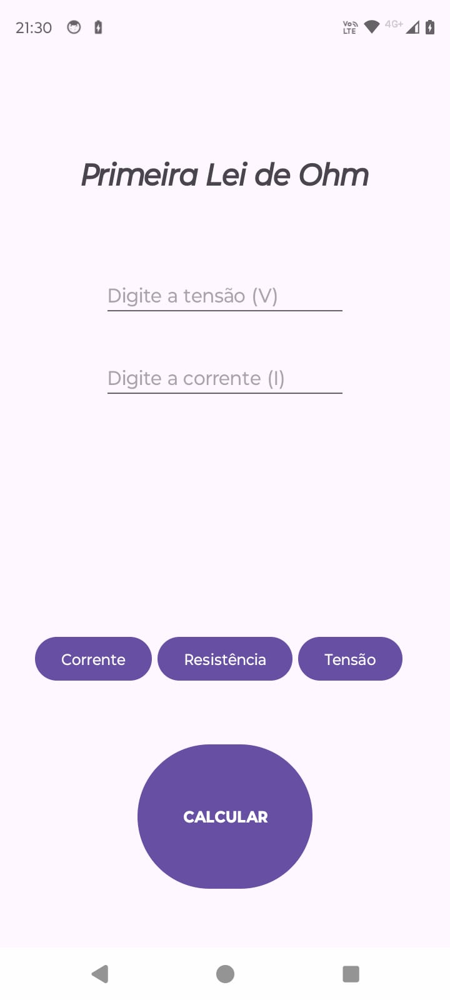

# Projetos 

 - Desenvolva um app chamado Calculadora (4 Operações Básicas) no Android Studio.

 - Desenvolva um app chamado Cálculo da primeira lei de Ohm.

	    1. Caso receba tensão e resistência calcular corrente;
	    2. Caso receba tensão e corrente calcular resistência;
	    3. Caso receba resistência e corrente calcular tensão.

# Calculadora
# Demonstração

## Tela Inicial

    

## Tela Tratamento de Erro

    

# Primeira Lei de Ohm
# Demonstração

## Tela Inicial

    

# Ferramentas Utilizadas

- IDE: `Android Studio`
- Linguagem: `Kotlin`
- Gerenciador: `Gradle`

## Autores

- [@Pedro Wolski](https://www.github.com/IamPdrin)
